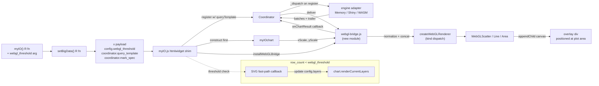

# WebGL bridge and coordinator wiring

User-stated target: bundled into the next minor release alongside other large-data finishing work. Scope here is the *bridge* — the component that connects the page-level coordinator to the WebGL renderers so that big-data registration in `setBigData()` actually paints something on the screen.

## Layers touched

`r-api` · `r-payload` · `js-coordinator` · `js-renderer` · `js-shim` · `pymyIO-mirror`

(myIO doesn't have a DB or HTTP API; the analogue for the API contract table below is the **JS module / message contracts** that span R-payload → JS-coordinator → JS-renderer.)

## Problem statement

The large-dataset virtualization stack landed in 159 commits on `develop`: R-side `setBigData()`, the JS `Coordinator`, source registry, engine adapters (Memory, Shiny, WASM), and three WebGL renderer classes (scatter, line, area). All of it is reachable from the R API for *registration*, but **none of it ever paints**. Two specific gaps:

1. **Coordinator results are dropped.** The htmlwidget shim calls `coord.register({...})` without an `onResult` callback. `Coordinator._deliverToRenderer` therefore short-circuits when batches arrive. Confirmed at [coordinator/index.js:252](../../inst/htmlwidgets/myIO/src/coordinator/index.js#L252).
2. **The coordinator never queries the engine on its own.** `_dispatch` only fires from `_scheduleDispatch`, which only fires from `setSelection` — i.e., another chart on the same source must brush before this chart sees data. A solo big-data chart shows an empty SVG forever. Confirmed at [coordinator/index.js:97](../../inst/htmlwidgets/myIO/src/coordinator/index.js#L97).

A third gap follows from the first two: **no path turns Arrow batches into pixels.** `window.myIO.webglRenderers.createWebGLRenderer` exists but nothing calls it. The chart's existing SVG `routeLayers` runs from `config.layers` (the small inline data), not from coordinator output.

Why this matters: `setBigData()` is the user-visible front door of the big-data feature. Until pixels appear, the entire 159-commit stack is plumbing-only and not demo-able to prospects, not testable end-to-end against a 1M-point dataset, not eligible for the gallery showcase that motivates the work.

## Hypothesis Verification

This design changes JS code paths inside an existing htmlwidget; no infrastructure, no new services, no new dependencies. The infrastructure-change gate does not apply. The verifications below cover the load-bearing premises about the existing code.

| Premise | Test | Result |
|---|---|---|
| Coordinator results are dropped without `onResult` | Read `_deliverToRenderer`; check call sites for `onResult` argument | VERIFIED ✓ — only `coord.register({...})` in [myIO.js:68-74](../../inst/htmlwidgets/myIO.js#L68) registers, no `onResult` passed; the only setter `onChartResult` is unused |
| Coordinator never dispatches on register | grep `_scheduleDispatch` and `_dispatch` for callers | VERIFIED ✓ — only `setSelection` triggers it; `register` is fire-and-forget |
| `chart.xScale` / `chart.yScale` are the right path | grep Chart.js for scale assignment | VERIFIED ✓ — set in [Chart.js:132-133](../../inst/htmlwidgets/myIO/src/Chart.js#L132) from `this.derived.*` after `applyDerivedScales` |
| `chart.runtime.xScale` does *not* exist | grep | VERIFIED ✓ — no such property |
| Scatter canvas has `pointerEvents="auto"` and will eat brush events | grep webgl renderers | VERIFIED ✓ — only scatter does; line and area use `"none"` |
| WebGL classes self-mount canvas via `appendChild` | grep | VERIFIED ✓ — bridge must pass an `el` that *is* the intended overlay container, can't reuse the chart's SVG group |
| `afterRender` event fires after scales/axes exist | grep `Chart.js` | VERIFIED ✓ — emitted at [Chart.js:288](../../inst/htmlwidgets/myIO/src/Chart.js#L288) |
| Beeswarm worker artifact is not built/shipped | look for `inst/htmlwidgets/myIO/workers/beeswarm-layout.js` | VERIFIED ✓ (refuted-as-shipped) — the file is absent. Beeswarm cannot ship in this bridge pass. |

Simplest fix that avoids the whole bridge: ship Slice 1 + Slice 2 (server-engine + SVG renderers) only. Skip WebGL entirely. Why this design wins over that alternative: the SVG renderers cap at ~10–20k points before they choke; the entire commercial premise of the big-data feature ("Observable + DuckDB-WASM-class viz, but in R") evaporates if we can't paint a 1M-point scatter. The bridge is the smallest change that delivers the feature's headline capability.

## Feature slices

### Slice 1 — Initial dispatch on chart registration

**One-line:** When a chart registers with the coordinator, the coordinator immediately fetches its initial result so the chart has data to paint without requiring a sibling brush.

**r-payload:** No change.
**js-coordinator:** `register()` schedules an initial `_dispatch(chartId)` with `preview: false`. Idempotent — if the chart is already registered (re-render path), the existing `unregister + register` flow plus this initial dispatch will produce one fresh result.
**js-renderer:** No change beyond receiving an extra initial batch via the existing `_deliverToRenderer` path.
**js-shim:** No change beyond Slice 3's `onResult` wiring.

**Cross-references:** Slice 3 depends on this — without initial dispatch, Slice 3's `onResult` callback fires only on cross-chart selection, which is the wrong UX for the demo case (single big-data chart).

### Slice 2 — Per-kind query template generation

**One-line:** The R payload carries a real `queryTemplate` per chart kind so the coordinator has something to ask the engine.

**r-api:** No new user-facing argument; templates derive from the existing layer set.
**r-payload:** `x$coordinator$query_template` becomes a string per chart kind (`scatter`, `line`, `area`) instead of being absent / empty. Generation lives in `setBigData()` and uses the chart's mark + the registered source's schema. The template uses the existing `{{where}}` / `{{limit}}` placeholders that `Coordinator._substituteTemplate` already handles. LTTB and hexbin SQL templates already exist in JS — those continue to be generated client-side from `markSpec.decimation`. The `query_template` field is the **base** template; decimation wraps it.
**js-coordinator:** Reads `queryTemplate` from registration (already does); now actually sees a non-empty value. No code change.
**js-shim:** Passes the R-derived `query_template` through to `coord.register({queryTemplate: ...})` instead of the current empty string.
**pymyIO-mirror:** **engine-additive.** pymyIO's payload generator must emit a parallel `query_template` field when its `setBigData()` equivalent is called. Tracked via the existing pending bump issue (mortonanalytics/pymyIO#3).

### Slice 3 — WebGL bridge

**One-line:** A new JS module accepts coordinator results, normalizes batch shapes, and drives the appropriate WebGL renderer mounted as a canvas overlay over the chart's plot area.

**r-api:** New optional argument `webgl_threshold` on `myIO()`, default `50000` rows. Validated as positive integer or `Inf` (disables WebGL path entirely). Below threshold, the existing inline SVG path remains the default. The coordinator-fed SVG path is opt-in via `unify_data_path = TRUE` (covered in Slice 4). At or above threshold AND markSpec.kind ∈ {scatter, line, area}, the bridge activates.
**r-payload:** New fields `x$config$webgl_threshold` (integer; mirrors the R argument) and `x$config$unify_data_path` (boolean opt-in for Slice 4).
**js-coordinator:** No change. Bridge subscribes via the existing `coord.onChartResult(chartId, callback)` setter.
**js-renderer:** No change to existing `WebGLScatter` / `WebGLLine` / `WebGLArea` classes. Bridge consumes them as-is via `createWebGLRenderer`.
**js-shim:** Construct `myIOchart` first, then install the result handler, then call `coord.register({..., onResult})`. Do not wait for the first `afterRender`; the constructor emits it synchronously before external listeners can attach. If `x.config.engine === "svg"` (including file:// fallback), skip bridge/result-handler install so inline SVG data renders unchanged.

**Bridge responsibilities (the new module):**
1. **Mount target.** Build a `<div>` positioned absolutely at the chart's plot-area bounding rect (computed from `chart.derived.margin` and chart width/height), append it as a sibling of the chart's `<svg>` so SVG axes/legend/brush sit above. CSS `pointer-events: none` on the wrapper, overridden per-renderer.
2. **Pointer-events and hover.** `WebGLScatter` defaults `captureHoverEvents` to `false`; tests/direct consumers opt into true explicitly. The bridge passes no hover flag. The canvas keeps `pointer-events: none`; bridged scatter hover listens on the SVG surface and emits rollover from a nearest-neighbor index built from the last delivered rows.
3. **Batch normalization.** Accept three shapes from `_deliverToRenderer({batches, trailer, markSpec})`:
   - `{rows: [...]}` (MemoryEngine)
   - `{batch: ArrowRecordBatch}` (WASM engine)
   - bare row arrays (legacy / Shiny adapter)
   Concatenate within a single delivery (do not overwrite); then call `renderer.update(allRows)` once per delivery so the GPU upload happens once.
4. **Color/group channel.** If `markSpec.channels.color` is present, the query aliases it to `color`; the bridge maps observed color values to stable category indices before `renderer.update(rows)`.
5. **Failure and trailer handling.** Renderer creation/update is wrapped in try/catch. Null WebGL context or context loss logs a warning and falls through to the SVG fast path automatically. `trailer.error` clears the renderer, emits a chart error event, and does not upload stale rows.
6. **Resize.** On chart resize event, recompute plot-area rect, resize wrapper div, call `renderer.resize(w, h)`, then re-call `renderer.update(lastRows)` on a 150 ms trailing debounce.
7. **First paint and empty results.** Show a lightweight loading overlay until first delivery. Zero-row results clear the renderer and emit `emptySelection`, displaying "No data in selection".
8. **Teardown.** On chart re-render or unregister, call `renderer.destroy()`, remove the wrapper div, null out the `onChartResult` callback. Idempotent.

**Cross-references:** Bridge requires Slice 1 (initial dispatch) and Slice 2 (real query template) to receive any data. Slice 4 covers the threshold-below path.

### Slice 4 — Threshold-below SVG fast path

**One-line:** When `unify_data_path = TRUE` and row count is under `webgl_threshold`, coordinator results feed the existing SVG renderers. Default `FALSE` preserves strict semver by leaving the inline SVG data path unchanged below threshold.

**r-api:** Same `webgl_threshold` argument as Slice 3 plus `unify_data_path = FALSE` default.
**r-payload:** Same plus `x$config$unify_data_path`.
**js-coordinator:** No change.
**js-renderer:** No change.
**js-shim:** When kind is eligible but row count is below threshold and `unify_data_path` is true, install a *different* `onChartResult` callback that updates the chart's `config.layers[i].data` from the batches and calls `chart.renderCurrentLayers()`. With the default false, do not register an `onResult` callback and do not schedule the initial query.

**Cross-references:** Same shim hook point as Slice 3, divergent by threshold check.

### Slice 5 — Demo + acceptance test surface

**One-line:** A vignette example and a Playwright spec that exercise the full path on a 1M-point dataset, proving the feature is reachable and performant.

**r-api / r-payload:** No code changes — uses existing `setBigData()` API.
**js-coordinator / js-renderer / js-shim:** No code changes.
**Test artifacts:** Extend [tests/playwright/large-data-linking.spec.ts](../../tests/playwright/large-data-linking.spec.ts) (or add a new spec) to assert canvas presence, point count parity, FPS floor, and brush-still-works. Vignette `large-data-linking.Rmd` gains a `webgl-scatter-1m` chunk if it doesn't already.

## JS module / message contracts (the API table for this design)

Every interface the bridge crosses, with the message shape. This is the single source of truth — no module may infer shapes from prose.

| Boundary | Shape | Direction | Notes |
|---|---|---|---|
| R → R-payload | `webgl_threshold: int \| Inf` (default 50000) | input | New `myIO()` arg |
| R → R-payload | `unify_data_path: bool` (default false) | input | Opt-in SVG coordinator path below threshold |
| R-payload → JS-shim | `x$config$webgl_threshold: int` | one-way | Plumbed verbatim |
| R-payload → JS-shim | `x$config$unify_data_path: bool` | one-way | Gates Slice 4 |
| R-payload → JS-shim | `x$coordinator$query_template: string` | one-way | Per-kind base SELECT with `{{where}}` and `{{limit}}` placeholders |
| JS-shim → Coordinator | `coord.register({chartId, queryTemplate, markSpec, sourceHandle, predicateFn})` | call | Existing API; queryTemplate now non-empty |
| JS-shim → Coordinator | `coord.onChartResult(chartId, callback)` | call | Existing setter; bridge / SVG-fast-path use it |
| Coordinator → bridge / SVG-fast-path | `callback({batches, trailer, markSpec})` | call | `batches` is heterogeneous; bridge normalizes |
| Coordinator → engine adapter | `_dispatch(chartId, {preview})` | internal | **Slice 1: now also fired from `register()`** |
| Bridge → WebGL renderer | `createWebGLRenderer({kind, el, width, height, xScale, yScale})` | call | Scatter defaults `captureHoverEvents` to false; direct consumers opt into true |
| Bridge → WebGL renderer | `renderer.update(rows)` | call | One call per delivery, post-concatenation |
| Bridge → WebGL renderer | `renderer.resize(w, h)` | call | On chart resize |
| Bridge → WebGL renderer | `renderer.destroy()` | call | On teardown |
| Chart → bridge | `'resize'` event | event | Triggers bridge.resize |

## Wiring dependency graph



Every UI-visible artifact (the canvas pixels, the SVG marks in fast-path mode) traces back to the engine adapter and through the coordinator. The graph has no orphan nodes.

## Acceptance criteria

All criteria are mechanically verifiable. Each maps to either a vitest unit test or a Playwright e2e spec.

**AC-1 (Slice 1 — initial dispatch).** Given a single big-data chart registered via `setBigData()` against a Memory engine with 100k rows and no other charts on the page, when the chart mounts, then within 500 ms `coord.onChartResult` fires at least once with a non-empty `batches` array. Test: vitest `coordinator-initial-dispatch.test.js`.

**AC-2 (Slice 2 — query template).** Given a `myIO()` chart with a single line layer and `setBigData()` against a 1M-row source with columns `t` and `value`, when the payload is generated, then `x$coordinator$query_template` is a string containing `SELECT`, the columns `t` and `value`, the `{{where}}` placeholder, and the `{{limit}}` placeholder. Test: testthat `test-setBigData-query-template.R`.

**AC-3 (Slice 3 — bridge mounts canvas).** Given a `myIO()` scatter against 1M synthetic rows and `webgl_threshold = 50000`, when the chart renders in a Playwright browser, then exactly one `<canvas>` element exists inside the chart container, positioned over the plot area (its bounding rect overlaps the SVG plot area by ≥ 95%), and its WebGL context returns a non-null `getContext('webgl2')` (or `webgl` fallback). Test: Playwright `webgl-bridge-mount.spec.ts`.

**AC-4 (Slice 3 — point count parity).** Given a 1M-row scatter, when the bridge has delivered the initial result and decimation is LTTB to 100k, then a debug accessor `window.myIO._debugBridge(chartId).pointCount` returns `100000`. Test: Playwright spec asserts the value via `page.evaluate`.

**AC-5 (Slice 3 — brush still works).** Given a bridged scatter chart, when the user brushes a region, then a `brushed` Shiny input fires (or the `brushed` event emits), and the canvas does not capture the pointerdown event (verified by `event.target.tagName === 'svg'` on pointerdown inside the plot area). Test: Playwright spec.

**AC-6 (Slice 3 — resize correctness).** Given a bridged scatter at 800×600, when the container resizes to 1200×800, then a 150 ms trailing debounce updates the canvas CSS width/height and re-calls `renderer.update(lastRows)` (verified via spy in test mode). Test: vitest with a JSDOM + canvas mock.

**AC-7 (Slice 3 — teardown idempotency).** Given a bridged chart, when `renderValue` is called a second time on the same element (re-render path), then exactly one canvas remains, the previous renderer's `destroy()` was called, and `coord.onChartResult` is set to the new callback (not appended). Test: vitest.

**AC-8 (Slice 4 — opt-in SVG fast-path below threshold).** Given a 10k-row source, `webgl_threshold = 50000`, and `unify_data_path = TRUE`, when the chart mounts, then no canvas is created, but `chart.config.layers[0].data` is replaced with the coordinator's batched rows (verified by row count match) and `chart.renderCurrentLayers` was called at least once. Given the same chart with default `unify_data_path = FALSE`, no result handler is registered and inline SVG data remains authoritative. Test: vitest.

**AC-9 (kind gating).** Given a bar chart (kind not in {scatter, line, area}) registered via `setBigData()`, when the chart mounts, then no canvas is created regardless of row count. Test: vitest.

**AC-10 (threshold sentinel).** Given `webgl_threshold = Inf`, when a 10M-row scatter mounts, then no canvas is created. If `unify_data_path = TRUE`, the SVG fast-path runs; otherwise the inline SVG path remains unchanged. Test: vitest.

**AC-11 (FPS floor — bench, not blocking).** On the CI Playwright environment with hardware-accelerated WebGL available, given a 1M-row scatter, when the user pans/zooms (or programmatic equivalent), then the rolling 1-second frame-time mean is ≤ 33 ms (i.e., ≥ 30 FPS). This is recorded as a benchmark; the threshold is **observational** and does not fail the build (CI hardware varies). Test: Playwright spec emits a `console.log` with the metric; release notes pull from it.

**AC-12 (multi-batch concat).** Given three delivered batches with 10, 20, and 30 rows, the bridge calls `renderer.update()` once with 60 rows in delivery order.

**AC-13 (cancellation).** Given brush/query A and then brush/query B before A returns, unregister or superseding dispatch aborts A and A's batches do not paint; only B's point count is observed.

**AC-14 (adapter throw).** Given `adapter.query()` rejects, the coordinator delivers a trailer error, the chart error event fires, the canvas is unchanged except for clearing, and no uncaught promise escapes.

**AC-15 (file:// fallback).** Given the shim resolves `engine === "svg"` because of file protocol fallback, bridge install is skipped: no canvas is created and inline SVG data remains the render source.

**AC-16 (empty-result render).** Given a zero-row delivery, the renderer receives `update([])`, the bridge emits `emptySelection`, and "No data in selection" is shown.

**AC-17 (parallel adapter init).** Given two concurrent `ensureAdapterFor(sourceId, ...)` calls, both await the same in-flight initialization and resolve to the same adapter instance.

## Tradeoffs

**Initial dispatch on `register` vs. require explicit kickoff.** Considered exposing a public `coord.dispatchInitial(chartId)` method and calling it from the shim. Rejected: every consumer would need to call it, and forgetting it is exactly the bug we are fixing. Putting it inside `register()` makes the right thing the default, costs nothing for charts that never receive selection, and is reversible if a consumer ever needs to opt out (add an option later). Risk: tests that previously relied on registration-without-dispatch will now see an extra dispatch — to be audited in implementation phase.

**Bridge as separate module vs. method on Coordinator.** A `Coordinator.bindRenderer(chartId, options)` method would be tighter coupling but pollutes the coordinator with rendering concerns. The coordinator is currently pure data-flow. Keeping the bridge as its own module preserves that boundary; the coordinator remains testable with no DOM.

**Canvas overlay vs. integrate into chart's render pipeline.** Could refactor the chart-type renderers to dispatch to WebGL when a flag is set. Rejected for v1: 25 chart-type files, deep regression surface, and only 3 kinds benefit from WebGL today. Overlay is a strict superset architecturally — chart-type code untouched, WebGL only fires when registered, easy to A/B against pure-SVG.

**Per-kind query template in R vs. JS.** Could derive templates entirely in JS from `markSpec`. Rejected: R-side already knows the source schema (column names, types) at `setBigData()` time; deriving the SELECT there avoids passing schema metadata across the boundary just so JS can rebuild it.

**Single WebGL canvas vs. one canvas per layer.** A multi-layer chart (line + area + scatter) could conceivably need three canvases. Deferred: v1 supports single-WebGL-layer charts. Multi-layer WebGL composition is queued as a follow-up — design assumes most big-data charts are single-mark for now.

**`captureHoverEvents` flag default.** Default `false`. There are no known direct production consumers outside tests, and default-false avoids a hidden contract where WebGL scatter unexpectedly captures brush/pointer events. Tests that need direct renderer hover pass `true` explicitly.

**Initial dispatch timing.** `coord.register()` now schedules a non-preview initial dispatch only when both `queryTemplate` and `onResult` are present. This changes timing for coordinator-using charts with result callbacks: custom adapters that perform expensive init/query work now pay that cost on mount. This must be called out in CHANGELOG/vignette notes.

## Devil's Advocate

**1. Most load-bearing assumption.** *That `myIOchart` has usable scales immediately after construction for the eligible non-faceted chart kinds.* The shim constructs the chart first because `afterRender` is emitted synchronously inside construction; relying on an external listener would miss the event.

**2. Verification.**

```
$ grep -n "this.emit(\"afterRender\"" inst/htmlwidgets/myIO/src/Chart.js
288:      this.emit("afterRender", { state });
```

Single emission point in `Chart.js`; it fires during construction, so the bridge must install after construction instead of registering an `afterRender` listener. Faceted charts delegate to `FacetController` and are out of v1 scope.

```
$ grep -n "afterRender" inst/htmlwidgets/myIO/src/layout/FacetController.js
```
<!-- FacetController remains a follow-up because faceted big-data errors in setBigData() for v1. -->

Result: VERIFIED ✓ for non-faceted charts; **deferred for faceted charts** — implementation must confirm or add an emit in FacetController. Faceted big-data is not a v1 acceptance criterion (no AC mentions facets); marking faceted bridged rendering as a known follow-up rather than a blocker.

**3. Simplest alternative that avoids the biggest risk.** Poll `chart.xScale` for non-null with `requestAnimationFrame`, install when ready, max 60 frames before giving up. Rejected for v1: constructing first and installing immediately is deterministic for the supported non-faceted chart kinds; polling would mask scale construction bugs.

**4. Structural completeness checklist.**

- [x] **For every UI component that calls an API, does that API appear in the API/Module Contract Table?** — Yes; bridge calls `coord.onChartResult`, `createWebGLRenderer`, `renderer.update/resize/destroy`. All listed.
- [x] **For every endpoint in the Contract Table, is a backing implementation implied?** — Yes; `coord.onChartResult` is existing in [coordinator/index.js:264](../../inst/htmlwidgets/myIO/src/coordinator/index.js#L264), `createWebGLRenderer` is existing in [renderers/webgl/index.js:29](../../inst/htmlwidgets/myIO/src/renderers/webgl/index.js#L29), bridge install is the new artifact.
- [x] **For every new data field that appears in one layer, does it appear in all three layers?** — `webgl_threshold` appears in R arg, R payload (`x$config$webgl_threshold`), JS shim (read by threshold check). `query_template` appears in R payload (`x$coordinator$query_template`), JS shim (passed to `coord.register`), JS coordinator (consumed by `_substituteTemplate`). `captureHoverEvents` is JS-only (renderer flag); not propagated through R because no user-facing knob is needed. pymyIO mirror noted for both R-payload fields under Slice 2 and Slice 3.
- [x] **For every acceptance criterion, can you name the specific call + expected response?** — AC-1 names `coord.onChartResult`. AC-2 names `x$coordinator$query_template`. AC-3 names `<canvas>` + `getContext`. AC-4 names `_debugBridge.pointCount`. AC-5 names `brushed` event. AC-6 names `renderer.update` spy. AC-7 names `destroy()` + `onChartResult`. AC-8 names `chart.renderCurrentLayers`. AC-9, AC-10 name negative cases. AC-11 names frame-time metric. All concrete.
- [x] **Does the Wiring Dependency Graph have an unbroken path from every UI component to its data source?** — Canvas pixels ← renderers ← bridge ← coord ← engine adapter. SVG-fast-path: SVG marks ← chart.renderCurrentLayers ← config.layers ← bridge_alt ← coord ← engine. Both unbroken.
- [x] **Are there integration test scenarios per slice?** — AC-1 covers Slice 1; AC-2 covers Slice 2; AC-3 through AC-7 cover Slice 3; AC-8 covers Slice 4; AC-11 covers Slice 5 perf bench.

## Diagrams

### Render lifecycle (single big-data scatter, 1M rows)

```
R user calls myIO(...) %>% setBigData(df, source_id="s1")
   │
   ▼
R generates payload
   x.config.specVersion = 2
   x.config.coordinator_enabled = TRUE
   x.config.webgl_threshold = 50000
   x.config.unify_data_path = FALSE
   x.coordinator.chart_id = "c_..."
   x.coordinator.mark_spec = {kind: "scatter", channels:..., decimation:...}
   x.coordinator.query_template = "SELECT t AS x, value AS y FROM s1 WHERE {{where}} LIMIT {{limit}}"
   x.bigdata.* = source registration fields incl. row_count = 1_000_000
   │
   ▼
htmlwidget renderValue(x) runs in browser
   ├─► bootCoordinator(x.config)              [page singleton]
   ├─► coord.registerSource({...})            [source registry]
   ├─► coord.ensureAdapterFor(...)            [async; engine init]
   ├─► new myIOchart({...})                   [SVG shell, axes, legend]
   ├─► installWebGLBridge({chart, coord, chartId, markSpec})
   │      ├─► creates overlay <div> at plot-area rect
   │      └─► createWebGLRenderer({kind:'scatter', el:overlay, w, h, xScale, yScale})
   ├─► coord.register({chartId, queryTemplate, markSpec, sourceHandle, predicateFn, onResult})
   │      └─► **NEW**: schedules _dispatch(chartId, {preview:false})    [Slice 1]
   │
   ▼
[engine adapter] returns batches asynchronously
   │
   ▼
coord._deliverToRenderer({batches, trailer, markSpec})
   │
   ▼
bridge.deliver({batches, trailer, markSpec})
   ├─► normalize each batch (rows | arrow.RecordBatch | bare array)
   ├─► concat into rows
   └─► renderer.update(rows)
          └─► WebGL upload → paint
```

### Pointer-event z-stack inside chart container

```
+--------------------------------------------------+
| chart container <div>                            |
|  +--------------------------------------------+  |
|  | <svg>  axes, legend, brush rect, marks   ◄─┼──── pointer events (above)
|  |  - SVG marks empty in WebGL mode          |  |
|  +--------------------------------------------+  |
|  +--------------------------------------------+  |
|  | <div class="myio-webgl-overlay">          |  |
|  |    style="position:absolute; left:Lp;     |  |
|  |           top:Tp; width:Wp; height:Hp;    |  |
|  |           pointer-events:none"            |  |
|  |  +-------------------------------------+ |  |
|  |  | <canvas>  WebGL pixels             │ |  |
|  |  +-------------------------------------+ |  |
|  +--------------------------------------------+  |
+--------------------------------------------------+
```

The overlay sits *under* the SVG in DOM order if appended first, but `position: absolute` floats it. To keep SVG events on top, append the overlay **before** the `<svg>` (or before the brush group) in DOM order, and rely on default stacking — children later in source order paint on top. Implementation must verify with the actual DOM tree.

## Open questions

1. **Brush-to-zoom vs. brush-to-select.** v1 remains selection-only, matching current SVG behavior. Brush-to-zoom-and-requery is a follow-up.
2. **Touch devices.** Out of scope for v1 acceptance criteria; brush plus canvas hit-testing is unverified on touch input.
3. **Multi-source / joined charts.** Out of scope; `setBigData()` is single-source today.
4. **Multi-layer big-data charts.** v1 errors at `setBigData()` time if multiple WebGL-eligible layers exist. Multi-canvas or joined-layer rendering is a follow-up.
5. **Faceted big-data.** v1 errors at `setBigData()` time if facets are enabled. `FacetController` render lifecycle is unverified for bridge install.
6. **WASM batch shape end-to-end.** Codex's note about `{batch: ArrowBatch, queryId}` shape — the Memory engine and the Shiny adapter are tested; the WASM adapter's exact result shape under the new initial-dispatch path needs a vitest with a fake WASM adapter to lock the contract.

## Commercial linkage

The commercial value of this design is the difference between "myIO has big-data plumbing" and "myIO can demo a 1M-point interactive scatter in a public-facing gallery." Concretely:

- **Demo gallery on morton-analytics.com/myio/** — currently caps at the SVG-comfortable point counts. With this bridge, a 1M-point scatter and a multi-million-row time series become showable. Per the brand strategy, this is the "best-in-class interactive web viz" proof point (per memory: ECharts/Plotly/deck.gl/Mosaic competitive set, not ggiraph).
- **CRAN narrative.** v1.x release notes can claim end-to-end big-data support, not "infrastructure for big-data support." This is the buyer-visible difference Codex's review implicitly noted.
- **pymyIO parity.** The R reference implementation gaining a working WebGL path keeps pressure on pymyIO to mirror it. Currently pymyIO is dormant on `specVersion: 1`; this design's R-payload changes are additive (won't break pymyIO) but raise the case for a coordinated bump.

This design does **not** dictate a version number; that decision belongs to the package author per the project's versioning conventions.

## Requirements impact

The myIO project does not maintain a separate `md/requirements/` source-of-truth directory. The relevant external contracts are:

- [md/design/large-dataset-virtualization-contract.md](../design/large-dataset-virtualization-contract.md) — already enumerates the coordinator-payload boundary. **Must be updated** to add `x.config.webgl_threshold`, `x.config.unify_data_path`, the non-empty `x.coordinator.query_template`, URL/file schema requirements, and the bridge's `onChartResult` consumption pattern.
- [md/design/large-dataset-virtualization-pymyIO-compatibility.md](../design/large-dataset-virtualization-pymyIO-compatibility.md) — must be updated to flag the new R-payload fields as `[engine-additive]` for pymyIO parity, leaning on the existing `mortonanalytics/pymyIO#3` issue.
- `docs/versioning-policy.md` — no change. `webgl_threshold` is optional and below-threshold coordinator SVG replacement is gated behind `unify_data_path = FALSE` by default, preserving the strict-semver invariant.

`/implement` against this design must update both contract documents in the same plan, not as an afterthought.
